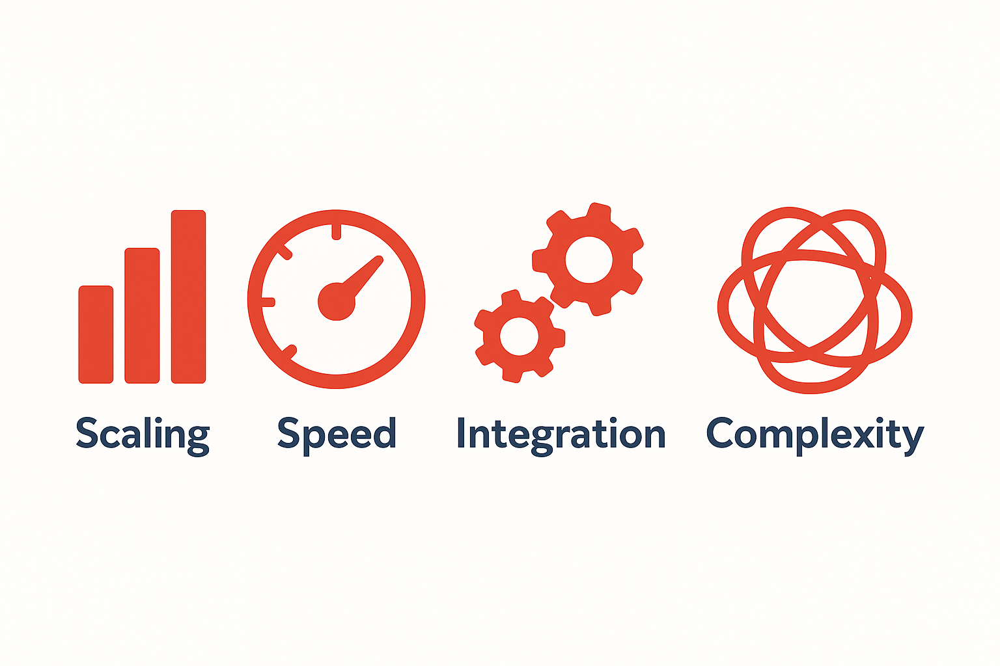

# {background-image="simple/eclipse-logo01.jpg" background-size="cover" background-opacity="0.2"}

<!-- Image prompt: Abstract AI neural network visualization -->

{width=500}

::: {.r-fit-text}
Multivac
:::

::: {.subtitle-text}
Your Complete AI Platform
:::

---

## The AI Implementation Gap

<!-- Image prompt: Bridge over chasm between prototype and production -->

::: {.columns}
::: {.column width="50%"}
### 90% of AI projects fail here

- Promising prototype ✓
- Production ready ✗
- Months of delay
- Budget overruns
:::

::: {.column width="50%"}
{width=400}
:::
:::

---

## Common Roadblocks

::: {.center}
{width=600}
:::

::: {.columns}
::: {.column width="25%"}
**Won't Scale**

Crashes under loads
:::

::: {.column width="25%"}
**Too Slow**

Users won't wait
:::

::: {.column width="25%"}
**Can't Integrate**

Isolated systems
:::

::: {.column width="25%"}
**Too Complex**

Beyond team skills
:::
:::

---

## Multivac Bridges the Gap

<!-- Image prompt: Platform connecting systems with data flow -->

::: {.columns}
::: {.column width="40%"}
{width=300}
:::

::: {.column width="60%"}
### From Prototype to Production

::: {.highlight-orange}
**⏱️ 3 weeks** not 6 months

**💰 Save €500K+** in development

**🚀 Enterprise-ready** from day one
:::
:::
:::

---

## What's Included

<!-- Image prompt: Three pillars - Security, Scale, Operations -->

::: {.columns}
::: {.column width="33%"}
### 🔒 Security Built-in
- Authentication & SSO
- Role-based access
- Data encryption
- Audit trails
:::

::: {.column width="33%"}
### 📈 Infinite Scale
- Auto-scaling
- Load balancing  
- Multi-region
- High availability
:::

::: {.column width="33%"}
### ⚙️ AI Operations
- Model versioning
- A/B testing
- Monitoring
- Cost optimization
:::
:::

---

## Real Impact {background-color="#e73c17"}

<!-- Image prompt: Dashboard showing dramatic metric improvements -->

::: {.columns}
::: {.column width="25%"}
::: {.center}
::: {.big-number}
300%
:::
User Adoption
:::
:::

::: {.column width="25%"}
::: {.center}
::: {.big-number}
95%
:::
Cost Reduction
:::
:::

::: {.column width="25%"}
::: {.center}
::: {.big-number}
7x
:::
Faster Performance
:::
:::

::: {.column width="25%"}
::: {.center}
::: {.big-number}
24hrs
:::
vs 70 days
:::
:::
:::

---

## Success Story: ESRS Reporting

<!-- Image prompt: Financial documents being processed by AI -->

::: {.columns}
::: {.column width="60%"}
### AI Document Processing at Scale

**Challenge:** Process 100M documents per quarter

**Results:**

- ⏱️ 70 days → 24 hours (500x faster)
- 📊 50% → 80% accuracy
- 💰 €1M → €100K per run (10x cheaper)
:::

::: {.column width="40%"}
{width=350}
:::
:::

---

## Success Story: Green Energy Assistant

<!-- Image prompt: AI assistant with wind turbines background -->

::: {.columns}
::: {.column width="40%"}
{width=350}
:::

::: {.column width="60%"}
### Aitana - Legal AI Assistant

**Challenge:** Navigate TBs of confidential contracts

**Results:**

- 🚀 Idea to POC in 2 weeks
- 🔒 Secure document handling
- 🤖 Intelligent contract agents
- 💻 Web UI & API ready
:::
:::

---

## What We Do

<!-- Image prompt: Engineers building AI systems -->

::: {.columns}
::: {.column width="70%"}
::: {.big-statement-orange}
✅ WE DELIVER
:::

### Production AI Systems
- **Engineering** excellence
- **Integration** expertise  
- **Deployment** mastery
- **Optimization** focus
:::

::: {.column width="30%"}
{width=300}
:::
:::

---

## What We DON'T Do {background-color="#314352"}

<!-- Image prompt: Crossed out workshop sticky notes -->

::: {.center}
::: {.big-statement-white}
❌ NO AI THEATER
:::

::: {.crossed-out}
Inspiration Workshops

Brainstorming Sessions

Use Case Discovery

Strategy Consulting
:::

### We build, not talk
:::

---

## Our Process

<!-- Image prompt: Timeline showing 4 stages -->

::: {.columns}
::: {.column width="25%"}
### 1️⃣ Assess
**2 days**

Technical review
:::

::: {.column width="25%"}
### 2️⃣ Design
**3 days**

Architecture plan
:::

::: {.column width="25%"}
### 3️⃣ Build
**2 weeks**

Implementation
:::

::: {.column width="25%"}
### 4️⃣ Deploy
**3 days**

Go live
:::
:::

::: {.center}
::: {.highlight-orange}
**Total: 3 weeks to production**
:::
:::

---

## Technology Stack

<!-- Image prompt: Cloud architecture with AI frameworks -->

::: {.center}
{width=200}

### AI Frameworks
Langchain • Gemini • OpenAI • Claude

### Infrastructure  
Cloud Native • Docker • Kubernetes • Terraform
:::

---

## ROI Comparison {background-color="#f6f8fa"}

<!-- Image prompt: Bar chart showing time and cost savings -->

::: {.columns}
::: {.column width="45%"}
### Traditional Build
- ⏱️ 6-12 months
- 💰 €500K - €2M
- 🔧 Ongoing maintenance
- 📈 Technical debt
:::

::: {.column width="45%"}
### With Multivac
- ⏱️ 2-4 weeks
- 💰 Predictable costs
- 🔄 Always updated
- 🎯 Focus on AI value
:::
:::

::: {.center}
::: {.big-statement-orange}
Save 6+ months and €500K+
:::
:::

---

## Deployment Options

<!-- Image prompt: Cloud vs on-premise servers illustration -->

::: {.columns}
::: {.column width="50%"}
::: {.center}
{width=200}

### ☁️ Multivac Cloud
Fully managed service
:::
:::

::: {.column width="50%"}
::: {.center}
{width=200}

### 🏢 Self-Hosted
Your infrastructure
:::
:::
:::

---

## Why Sunholo? {background-image="simple/eclipse-logo01.jpg" background-size="cover" background-opacity="0.1"}

<!-- Image prompt: Four pillars of strength -->

::: {.columns}
::: {.column width="50%"}
### 🎯 Laser Focus
Production AI only

### 🏆 Proven Success
Since 2023
:::

::: {.column width="50%"}
### 🤝 Cloud Native
Modern tech stack

### 📈 Results Driven
Your success = Our success
:::
:::

---

## Next Steps {background-color="#e73c17"}

<!-- Image prompt: Rocket launching -->

::: {.big-statement-white}
Ready to accelerate your AI?
:::

::: {.next-steps}
📞 Technical Assessment

📋 Custom Proposal

🚀 Start in Days
:::

::: {.big-email}
multivac@sunholo.com
:::

---

## Thank You

::: {.center}
{width=300}

### Let's Build Your AI Future Together

multivac@sunholo.com

[linkedin.com/company/sunholo](https://linkedin.com/company/sunholo)
:::